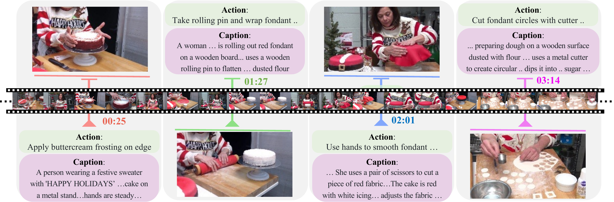
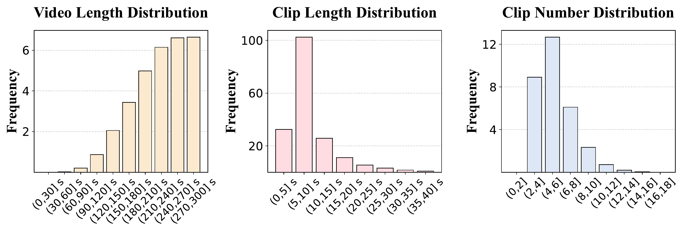
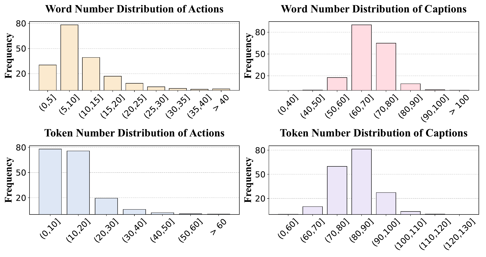
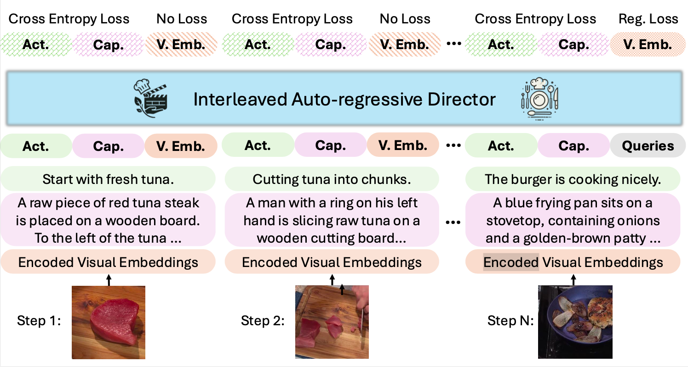
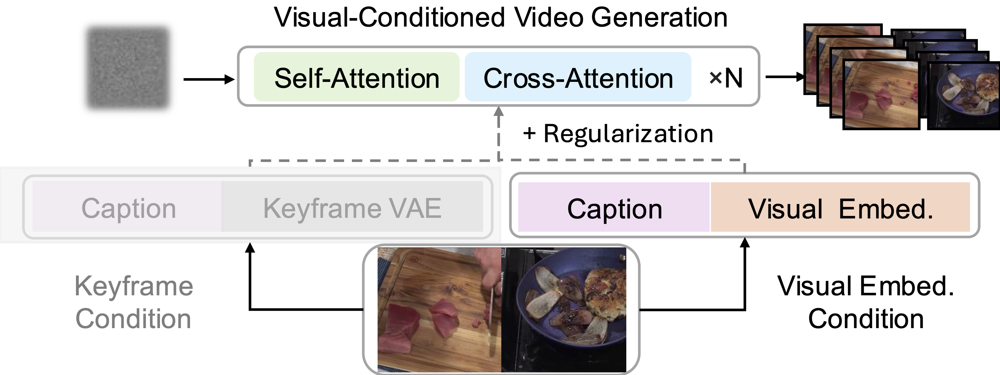

# VideoAuteur: Towards Long Narrative Video Generation

[](https://videoauteur.github.io)
[](https://arxiv.org/abs/2501.06173)
[](https://huggingface.co/datasets/lambertxiao/CookGen_youcook2)
[](https://huggingface.co/datasets/lambertxiao/CookGen_Howto100M)
This is the official repository for "VideoAuteur: Towards Long Narrative Video Generation"


## Abstract

Recent video generation models have shown promising results in producing high-quality video clips lasting several seconds. However, these models face challenges in generating long sequences that convey clear and informative events, limiting their ability to support coherent narrations. In this paper, we present a large-scale cooking video dataset designed to advance long-form narrative generation in the cooking domain. We validate the quality of our proposed dataset in terms of visual fidelity and textual caption accuracy using state-of-the-art Vision-Language Models (VLMs) and video generation models, respectively. We further introduce a Long Narrative Video Director to enhance both visual and semantic coherence in generated videos and emphasize the role of aligning visual embeddings to achieve improved overall video quality. Our method demonstrates substantial improvements in generating visually detailed and semantically aligned keyframes, supported by finetuning techniques that integrate text and image embeddings within the video generation process.

## CookGen Dataset (**YouCook2**: [](https://huggingface.co/datasets/lambertxiao/CookGen_youcook2))

CookGen contains long narrative videos annotated with actions and captions. Each source video is cut into clips and matched with labeled "actions". We use refined pseudo labels from ASR for Howto100M videos and manual annotations for Youcook2 videos. High-quality captions are generated using state-of-the-art VLMs (GPT-4 and a finetuned video captioner) for all video clips.

The dataset is released at Huggingface: 

**Youcook2**: [](https://huggingface.co/datasets/lambertxiao/CookGen_youcook2)



### Dataset Statistics

- **Video Length**: 30-150 seconds
- **Clip Duration**: 5-30 seconds
- **Clips per Video**: 4-12 clips


- **Text Annotations**:
  - Actions: 10-25 words (20-60 tokens)
  - Captions: 40-70 words (up to 120 tokens)

## VideoAuteur Pipeline

Our approach consists of two main components:

### 1. Long Narrative Video Director

- Uses an interleaved auto-regressive model to generate sequential outputs
- Generates captions, actions, and visual states
- Features:
  - Optimized visual latent space representation
  - Specialized regression loss functions
  - Refined regression task formulation for temporal coherence

### 2. Visual-Conditioned Video Generation

- Integrates action sequences, captions, and visual states from the narrative director
- Advances beyond traditional Image-to-Video approaches
- Implements continuous visual latent conditioning
- Includes robust error handling mechanisms for stable output

## Demo

Please visit our [project page](https://videoauteur.github.io) to view demos of:
- Interleaved Auto-regressive Director Generation
- Language-Centric Director Generation
- Pipeline Extensions (Tesla Car Ad, Movie Trailer, Nature Documentary)

## Citation
```
@article{xiao2024narrative,
  title={VideoAuteur: Towards Long Narrative Video Generation},
  author={Xiao, Junfei and Cheng, Feng and Qi, Lu and Gui, Liangke and Cen, Jiepeng and Ma, Zhibei and Yuille, Alan and Jiang, Lu},
  journal={arXiv preprint arXiv:2501.06173},
  year={2024}
}
```

## Acknowledgments

Special thanks to Kelly Zhang, Ziyan Zhang, Yang Zhao, and Jiaming Han for their support and discussion.

## Disclaimer

This is a research prototype and not an officially supported ByteDance product.
